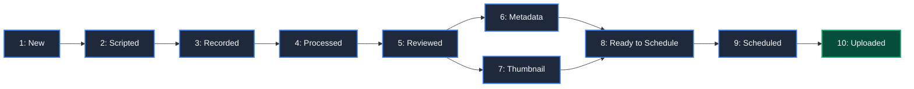
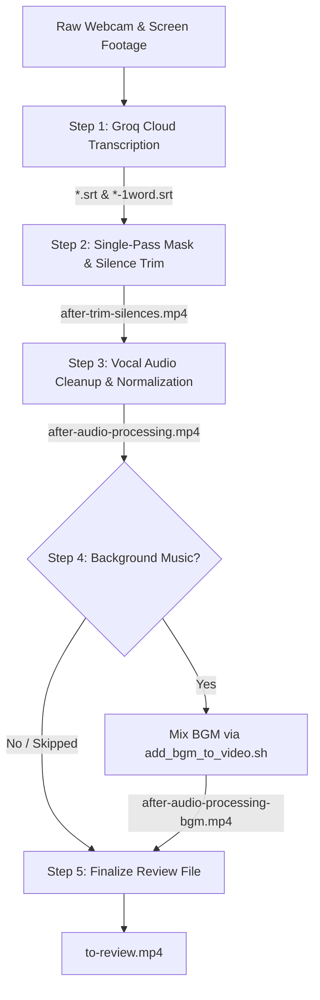

# 🎬 Content & Video Processing Pipelines

The **Pipelines** module provides an end-to-end orchestration suite for creating, processing, tracking, and scheduling YouTube videos. It automates the multi-stage lifecycle from initial project creation, Excalidraw scripting, and single-pass FFmpeg editing to quality review, metadata authoring, Google Sheets calendar scheduling, and publishing.

---

## 🏗️ Architecture & Pipeline Lifecycle

The content pipeline follows a structured 10-stage lifecycle, automatically tracking asset presence across your project workspace (`~/Videos/YT Projects/` by default):



---

## 🛠️ CLI Quick Reference

All pipeline subcommands are accessible via the `phantom pipeline` CLI:

```bash
# Check status and overview of all YouTube projects
phantom pipeline status

# Create a brand new YouTube video project workspace
phantom pipeline newvideo "My New Video Title"

# Run automated video processing (transcription, masking, silence trim, audio cleanup, BGM)
phantom pipeline process /path/to/webcam.mp4 /path/to/screen.mp4 --bgm lofi-chill

# Manage the Google Sheets Content Calendar
phantom pipeline calendar list
phantom pipeline calendar next-date --platform youtube
phantom pipeline calendar add --title "My Video Title"
phantom pipeline calendar remove 5
```

---

## 📊 Pipeline Status Tracker: [`current_pipeline.py`](file:///home/hassan/Desktop/programming/phantom-editor/pipelines/current_pipeline.py)

The status tracker scans project folders, validates required assets, connects to the Google Sheets Content Calendar, and displays an overview with progress bars, file checklists, and actionable next steps.

### CLI Usage

```bash
# View human-readable terminal dashboard
phantom pipeline status

# Show detailed file listings per project
phantom pipeline status --verbose

# Custom project directory
phantom pipeline status --dir /custom/path/to/projects

# Output complete pipeline state as JSON (for scripting/integrations)
phantom pipeline status --json
```

### The 10 Pipeline Stages

| Stage | Name | Trigger / File Requirements | Next Action Required |
| :---: | :--- | :--- | :--- |
| **1** | **New** | Newly created folder with no script or raw footage. | Create `.excalidraw` presentation script. |
| **2** | **Scripted** | Contains `.excalidraw` script file. | Record raw webcam and screen footage. |
| **3** | **Recorded** | Raw video files present, no `to-review.mp4`. | Run `phantom pipeline process`. |
| **4** | **Processed** | `to-review.mp4` generated by pipeline. | Review video and export `final.mp4`. |
| **5** | **Reviewed** | `final.mp4` exists; missing metadata/thumbnail. | Create `metadata.json` and design thumbnail. |
| **6** | **Added Metadata** | `final.mp4` + `metadata.json` present; missing thumbnail. | Design and add thumbnail image. |
| **7** | **Added Thumbnail** | `final.mp4` + thumbnail present; missing `metadata.json`. | Create `metadata.json`. |
| **8** | **Ready to Schedule** | `final.mp4` + `metadata.json` + thumbnail image present. | Run `phantom pipeline calendar add`. |
| **9** | **Scheduled** | Matched in Google Sheets Content Calendar. | Upload video to YouTube (`phantom yt upload`). |
| **10** | **Uploaded** | `metadata.json` contains a valid YouTube URL. | 🎉 Pipeline complete! |

### Sample Terminal Output

```text
==============================================================================
 🎬  YOUTUBE CONTENT PIPELINE SUMMARY
 Directory: /home/hassan/Videos/YT Projects
==============================================================================
1. My new app changes YouTube forever
   Stage 5/10: [Reviewed]
   Pipeline: ✓1 ➔ ✓2 ➔ ✓3 ➔ ✓4 ➔ [5:Rev] ➔ 6:Meta ➔ 7:Thumb ➔ 8:Ready ➔ 9:Sched ➔ 10:Upload
   ➜ Next Step: Create metadata.json AND design thumbnail (e.g. thumbnail.png)
   Files: [✗ script (.excalidraw)] | [3 raw file(s)] | [✓ to-review.mp4] | [✓ final.mp4] | [✗ metadata.json] | [✗ thumbnail]
------------------------------------------------------------------------------
📊 PIPELINE OVERVIEW & STATS
 Total Projects: 1
 New: 0 | Scripted: 0 | Recorded: 0 | Processed: 0 | Reviewed: 1 | Metadata: 0 | Thumbnail: 0 | Ready: 0 | Scheduled: 0 | Uploaded: 0
 ⚡ Action Required: 1 video(s) in progress / awaiting next steps
==============================================================================
```

---

## 📁 Project Initialization: [`newvideo.py`](file:///home/hassan/Desktop/programming/phantom-editor/pipelines/newvideo.py)

Creates a standardized workspace folder inside `~/Videos/YT Projects/<project_name>` (or a custom directory), verifying that the directory does not already exist and printing onboarding instructions.

### CLI Usage

```bash
phantom pipeline newvideo "How to Build AI Agents"
```

### Options

| Option | Short | Type | Default | Description |
| :--- | :--- | :--- | :--- | :--- |
| `name` | | Positional | | Name of the new video project (required). |
| `--dir` | `-d` | Path | `~/Videos/YT Projects` | Base directory for YouTube projects. |

---

## ⚡ Video Processing Engine: [`process_video.py`](file:///home/hassan/Desktop/programming/phantom-editor/pipelines/process_video.py)

The video processing engine executes an automated 5-step media pipeline that transforms raw webcam and screen recordings into a polished review video (`to-review.mp4`).



### Pipeline Steps in Detail

1. **Step 1: Cloud Transcription (`transcribe_cloud.py`)**
   - Transcribes the audio track using the Groq Whisper cloud API.
   - Generates both a standard sentence-level `.srt` and a word-level `*-1word.srt` subtitle file.
2. **Step 2: Single-Pass Masking & Silence Trimming ([`single_pass_mask_trim.py`](file:///home/hassan/Desktop/programming/phantom-editor/pipelines/single_pass_mask_trim.py))**
   - Analyzes word-level SRT timestamps for voice triggers (`"webcam start"` and `"webcam stop"`).
   - Generates an anti-aliased rounded-corner mask for the webcam overlay.
   - Computes speech intervals with Silero VAD (`trim_silences.py`).
   - Executes webcam overlay positioning and dead-air silence removal inside a single unified FFmpeg filtergraph, avoiding redundant re-encodings.
3. **Step 3: Vocal Audio Enhancement (`process_audio.sh`)**
   - Strips and processes audio using DeepFilterNet noise suppression.
   - Applies dual-pass EBU R128 `loudnorm` normalization and multiplexes the enhanced track back into the video (`after-audio-processing.mp4`).
4. **Step 4: Background Music Addition (`add_bgm_to_video.sh`)**
   - Mixes in background music from the local library or custom path with automated ducking and volume adjustment (`after-audio-processing-bgm.mp4`).
   - Skipped automatically if no `--bgm` flag is passed.
5. **Step 5: File Finalization**
   - Safely copies the latest generated video file to `to-review.mp4`, preparing the cut for manual review.

### Smart Resumption & Caching

`process_video.py` inspects intermediate output files and modification timestamps. If a step has already succeeded and its source has not changed, that step is skipped automatically. Pass `--force` to re-execute every step from scratch.

### CLI Options

```bash
phantom pipeline process <webcam_video> [screen_video] [options]
```

| Option | Short | Type | Default | Description |
| :--- | :--- | :--- | :--- | :--- |
| `webcam` | | Positional / Flag | | Path to webcam or main video file. |
| `screen` | | Positional / Flag | `webcam` | Path to screen recording video (defaults to webcam if omitted). |
| `--preset` | | `portrait` \| `landscape` | `portrait` | Preset overlay mode (portrait: 400px width; landscape: 550px width). |
| `--width` | `-w` | int | | Explicit width of webcam overlay in pixels. |
| `--all` | `-a` | flag | `False` | Display webcam overlay continuously across the entire video. |
| `--bgm` | `--bgm-track` | str | `None` | Background music track name or file path. |
| `--volume` | | int (1–100) | `10` | Volume percentage for background music. |
| `--yes` | `-y` | flag | `False` | Skip interactive confirmation prompts and run automatically. |
| `--force` | `-f` | flag | `False` | Force re-execution of all pipeline steps regardless of cached files. |

---

## ✂️ Single-Pass Processor: [`single_pass_mask_trim.py`](file:///home/hassan/Desktop/programming/phantom-editor/pipelines/single_pass_mask_trim.py)

Directly invoked by Step 2 of `process_video.py`, or callable standalone for targeted video builds.

### Key Capabilities

* **Voice-Triggered Webcam Overlay**: Searches the 1-word subtitle stream for `"webcam start"` and `"webcam stop"` commands to toggle between full-screen screencast and picture-in-picture webcam overlay.
* **Interactive Fallback**: If no voice commands are detected and `--all` is not specified, prompts the user to choose full-screen webcam or top-right overlay. In non-interactive (`-y`) mode, defaults to top-right screen overlay.
* **Rounded Mask Generation**: Synthesizes a transparent PNG mask with customizable corner radius (Pillow) to produce modern rounded corners on the webcam stream.
* **Unified Complex Filtergraph**: Chains `overlay`, `select`, `setpts`, and audio resample filters into a single FFmpeg process, cutting encoding time by ~50% compared to sequential passes.

### Standalone CLI Usage

```bash
python pipelines/single_pass_mask_trim.py \
    webcam.mp4 \
    screen.mp4 \
    --srt webcam-1word.srt \
    --output after-trim-silences.mp4 \
    --preset portrait
```

---

## 📅 Content Calendar: [`calendar.py`](file:///home/hassan/Desktop/programming/phantom-editor/pipelines/calendar.py)

The Content Calendar CLI integrates directly with Google Sheets, allowing you to manage publication schedules, query upcoming slots, and automatically assign release dates.

### Subcommands

#### 1. `list`: Display Content Calendar

Displays scheduled entries in a formatted terminal table with platform badges, dates, and live status.

```bash
# List all scheduled content
phantom pipeline calendar list

# Filter by platform
phantom pipeline calendar list --platform youtube
phantom pipeline calendar list --platform twitter
```

#### 2. `next-date`: Compute Next Available Publish Slot

Computes the earliest open date according to channel publication policies:
* **YouTube**: 1 video per day at **10:30 PM (22:30)**.
* **Twitter**: 1 post per day at **12:00 PM (12:00)**.

```bash
# Calculate next YouTube date
phantom pipeline calendar next-date --platform youtube

# Output in JSON format
phantom pipeline calendar next-date --platform youtube --json
```

#### 3. `add`: Schedule a Video

Adds a new row to the Google Sheet. If `--date` is omitted, the script automatically assigns the next available date slot.

```bash
# Auto-assign next date
phantom pipeline calendar add \
    --title "How to Build AI Agents" \
    --platform youtube \
    --desc "A deep-dive tutorial into building autonomous agents"

# Explicit date & URL
phantom pipeline calendar add \
    --title "Automation Tip #5" \
    --platform twitter \
    --date "tomorrow" \
    --url "https://x.com/..."
```

#### 4. `remove`: Remove an Entry

Removes a row by its row number or exact/fuzzy title match.

```bash
# Remove by row index
phantom pipeline calendar remove 4

# Remove by title
phantom pipeline calendar remove --title "How to Build AI Agents"
```

---

## 🔌 Google Sheets Backend: [`google_sheet_utils.py`](file:///home/hassan/Desktop/programming/phantom-editor/pipelines/google_sheet_utils.py)

The backend driver powering the calendar CLI:

* **OAuth 2.0 Flow & Token Management**: Automatically handles Google OAuth authentication and caches tokens in `pipelines/tokens/sheets_token.json`. Looks for `client_secret.json` in project token folders.
* **Dynamic Header & Schema Mapping**: Detects existing sheet headers (`Title`, `Description`, `URL`, `Publish Date`, `Platform`) or initializes default columns if the sheet is empty.
* **Data Model**: Uses the `CalendarRecord` dataclass for type safety and easy conversion between API rows and Python objects.
* **CRUD API**: Exposes `list_records()`, `add_record()`, `remove_record()`, and `update_record()`.

### Configuration

Ensure your `.env` file contains your Google Sheet ID:

```bash
CONTENT_CALENDAR_SHEET_ID=your_google_sheet_id_here
```

---

## 🔍 Validation & Pipeline Utilities: [`pipeline_status.py`](file:///home/hassan/Desktop/programming/phantom-editor/pipelines/pipeline_status.py)

Provides shared validation and terminal formatting helpers used across pipeline modules:

* `is_valid_yt_url(url)`: Fast regex/URL validation without network requests.
* `is_4k_video(video_path)`: Detects 4K video streams for downscaling.
* `is_valid_video_file(video_path)`: Uses `ffprobe` to ensure video files are intact and non-zero length.
* `get_pipeline_outputs(...)` & `compute_pipeline_status(...)`: Computes file dependency graphs and step execution requirements.
* `print_pipeline_overview(...)` & `confirm_execution(...)`: Displays interactive pre-flight summaries before running heavy encoding tasks.
